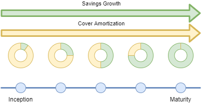

# Value proposition

## Unique decentralised savings cover

- Worried about your expensive equipment?
- Saving towards your next upgrade?
- Paying too much?

Join SureX Mutual. We have each other covered.

## How it works
Mutual provides members with a hybrid savings insurance policy. This policy provides both insurance coverage, as well as a savings instrument that grows toward a specific target over a specific period. As the savings grow, the risk is reduced, and so too the cost of insurance, because the policy covers the outstanding balance of the savings target instead of the associated equipment.

